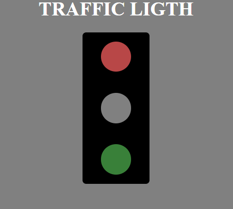

# 🚦 Traffic Light Simulator

A simple **Traffic Light Simulation** built with **React.js**. The lights cycle between **🔴 Red → 🟡 Yellow → 🟢 Green** at regular intervals.

---

## 🎥 Demo Video

Click the image below to watch the demo:

[](./Traffic.mp4)


## ✨ Features
- 🚥 **Automatic Light Transition** (🔴 → 🟡 → 🟢)  
- 🎨 **Smooth Color Animation**  
- 📱 **Responsive & Minimal Design**  
- ⚡ **Fast & Lightweight**  

---

## 🛠️ Technologies Used
- ⚛️ **React.js** (Functional Components & Hooks)  
- 🎨 **Tailwindcss** (Animations & Styling)


---

## 🔗 Live Preview

You can view the live preview of the project : [🚀 Live Demo](https://traffic-light-teal-two.vercel.app/)

---

## 📌 Installation & Usage
1. 📦 **Clone the repository:**
   ```bash
   git clone https://github.com/Rahul-65-Patra/TrafficLight.git
2. 📁 **Navigate to the project directory:**
```bash
  cd TrafficLight
```
3. 🧱 **Install dependencies:**

```bash
  npm install
```
4. 🚀 **Start the development server:**
```bash
  npm run dev
```
5. 🌐 **Visit in browser:**
Open http://localhost:5173

---

## 🏅 Badges

Add badges from somewhere like: [shields.io](https://shields.io/)

[](https://choosealicense.com/licenses/mit/)

[](https://opensource.org/licenses/)

[](http://www.gnu.org/licenses/agpl-3.0)

---

## 📄 License

This project is licensed under the [MIT License](LICENSE).


